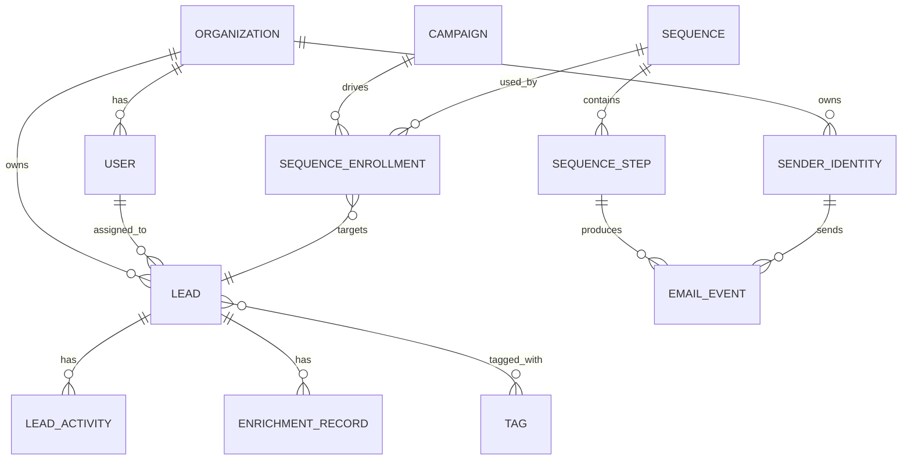

# LeadFlow — Product Requirements Document

## 1. Overview

LeadFlow is a SaaS platform for discovering local/global businesses via Google Maps, enriching them into structured leads, and running personalized, compliant email outreach and follow-up sequences from a connected mailbox (Namecheap Private Email or any SMTP/IMAP provider).

**Primary users:** agencies, freelancers (web/design/dev, marketing), and B2B sales teams doing geography- or vertical-targeted cold outreach.

## 2. Personas

| Persona | Goal | Key workflows |
|---|---|---|
| **Solo freelancer (Mohammad-type)** | Fill pipeline with local business leads for web/design services | Scrape a city+category, auto-draft emails, send from own domain |
| **Agency ops manager** | Run outreach for multiple clients/verticals at scale | Bulk import, team assignment, sequence templates per vertical |
| **SDR / sales rep** | Work an assigned lead list to quota | Kanban pipeline, activity logging, reply handling |

## 3. Functional Requirements

### 3.1 Google Maps Business Lead Extraction Module

**FR-1.1 — Region & category search**
- User defines a search by city/country name or a center point + radius (map-drag or address autocomplete).
- User selects one or more categories from a curated taxonomy (50+ verticals: restaurants, law firms, dental clinics, e-commerce, etc.), mapped to Google Places `type`/keyword combinations.
- *Acceptance:* a search returns a paginated result set with visible total-match count and a live map preview of pins before committing to a full extraction job.

**FR-1.2 — Data extraction**
- For each place returned by Places API (Nearby Search + Place Details), capture: name, formatted address, geocoded lat/lng, phone (international format), category, rating, review count, opening hours, website URL.
- **Email, social links, and DBA/alias detection are NOT sourced from Google Places (Places does not expose them).** They are derived by a separate, opt-in **Enrichment Job** that fetches the business's own public website and parses visible contact pages, `mailto:` links, and footer social icons.
- *Acceptance:* every enriched field is tagged with its source (`places_api`, `site_scrape`, `manual`) and a timestamp, so users can see provenance and confidence, not just a value.

**FR-1.3 — WHOIS lookups**
- WHOIS is used only for **domain-level** metadata (registrar, registration age, nameservers) to support lead scoring ("newly registered domain," "no site yet"). Most gTLD WHOIS records have redacted registrant contact data since GDPR-driven privacy layers (2018+), so WHOIS is explicitly **not** treated as a reliable personal/business email source in the data model or UI copy.

**FR-1.4 — Rate limiting & respectful crawling**
- Google Places calls go through a server-side proxy that enforces per-account QPS caps aligned to the user's Google Cloud quota and billing tier.
- Website enrichment crawler: honors `robots.txt`, sets a descriptive User-Agent with an opt-out contact URL, caps concurrent requests per domain to 1, and enforces a minimum 2–5s delay between requests to the same host.
- *Acceptance:* a domain that returns HTTP 429/503 or blocks via robots.txt is marked `crawl_blocked` and skipped, never retried in a tight loop.

**FR-1.5 — Deduplication**
- Dedup key is a composite: normalized phone (E.164) OR normalized domain OR (name similarity ≥ 0.9 via trigram + address proximity ≤ 100m).
- On match, records are merged with a field-level "most complete / most recent wins" strategy, and merge history is retained for undo.

### 3.2 Lead Organization & Management

**FR-2.1 — Pipeline** — Kanban board with stages New Lead → Contacted → Responded → Qualified → Closed → Archived, drag-and-drop, per-stage WIP counts.

**FR-2.2 — Views** — List (sortable/filterable table), Kanban, and Map (clustered pins colored by stage).

**FR-2.3 — Filtering & search** — Combinable filters (industry, location radius, lead score range, last-contact date range, response status, tags); full-text search across name/notes/emails.

**FR-2.4 — Lead scoring** — Weighted score (0–100) from: data completeness (25%), industry-ICP match (25%), website quality signals (20%), engagement (opens/clicks/replies, 30%). Score and its component breakdown are both visible, not just the final number.

**FR-2.5 — Export** — CSV/XLSX/JSON export with a field picker and saved export presets.

**FR-2.6 — Collaboration** — Assignment, @-mention internal notes, full activity timeline per lead (status changes, emails sent/opened/clicked, notes).

### 3.3 Personalized Email Outreach Engine

**FR-3.1 — Personalization data points** — homepage/about copy excerpts, detected services list, USPs, missing-service gaps, city/region references, and a business-size-inferred tone (micro/small/mid) feed a per-lead "personalization brief" object.

**FR-3.2 — Templates** — Handlebars-style variables (`{{business_name}}`, `{{observed_gap}}`) plus conditional blocks (`{{#if has_no_ssl}}...{{/if}}`); live preview against a real lead before sending.

**FR-3.3 — A/B testing** — Subject-line and body variants split evenly (or weighted) per campaign; statistical significance indicator once a minimum sample (configurable, default 30/arm) is reached.

**FR-3.4 — AI-assisted drafting** — Draft generation is a suggestion the user reviews and edits before sending; no fully autonomous send in the default configuration (see Compliance §6).

### 3.4 Namecheap / SMTP-IMAP Integration

**FR-4.1** — OAuth where supported; otherwise SMTP/IMAP host+port+credentials with STARTTLS/SSL, tested via a connection-check call before saving.

**FR-4.2** — Credentials encrypted at rest (see Architecture doc, §Security) — never returned to the client in plaintext after initial entry.

**FR-4.3** — Multiple sender identities/aliases per account, each with its own display name, signature, and per-identity daily send cap.

**FR-4.4** — Deliverability dashboard: SPF/DKIM/DMARC record status (via DNS lookups), bounce rate, spam-complaint rate, inbox-placement trend.

### 3.5 Follow-up Automation Sequences

**FR-5.1 — Visual builder** — Node-based sequence editor: delay nodes (hours/days/business-days, timezone-aware), condition nodes (opened / clicked / replied / visited site / no engagement), branching to alternate paths per condition.

**FR-5.2 — Vertical templates** — Prebuilt sequence + timing packs per industry (e.g., "law firm: 3-touch, 4/7/14-day cadence").

**FR-5.3 — List hygiene** — Automatic unsubscribe link + suppression list; hard-bounce auto-suppression; soft-bounce retry-then-suppress after N attempts.

**FR-5.4 — Sending limits & warmup** — Per-identity daily cap enforcement; a warmup schedule (ramping volume over 2–4 weeks) recommended and enforced by default for identities on domains younger than 90 days.

## 4. Non-Functional Requirements

- **Performance:** Kanban/List views interactive-render <300ms for 5k leads (virtualized rows); map view clusters >1k pins client-side.
- **Scalability:** scraping and email sending run as horizontally-scalable background workers, decoupled from the API via a queue.
- **Security:** encryption at rest for credentials and PII; role-based access control (Owner/Admin/Member); audit log for exports and sends.
- **Reliability:** send jobs are idempotent (dedup key per lead+sequence-step) to prevent double-sends on retry.
- **Availability target:** 99.5% for the API; scraping/sending workers degrade gracefully (queue backs up, doesn't drop jobs) during outages.

## 5. Data Model (Entities)

Core tables (see Architecture doc §Database Schema for full DDL): `organizations`, `users`, `leads`, `enrichment_records`, `lead_activities`, `tags`, `lead_tags`, `sender_identities`, `templates`, `campaigns`, `sequences`, `sequence_steps`, `sequence_enrollments`, `email_events`, `suppression_list`.

## 6. Compliance Considerations (read before building sending features)

- **CAN-SPAM (US):** every commercial email requires a working unsubscribe, honored within 10 business days, accurate From/Subject, and a physical postal address in the footer. LeadFlow enforces this at the template-render layer (send is blocked if these tokens are missing).
- **GDPR / ePrivacy (EU/UK contacts):** B2B "legitimate interest" outreach is narrower than many cold-email guides suggest, and requirements vary by member state (some, e.g. Germany, treat unsolicited B2B email more strictly than others). LeadFlow should surface the lead's country and flag EU/UK contacts for a stricter consent/legitimate-interest review step rather than silently sending — this is a legal judgment call for the user/org, not something the product can fully automate away.
- **Google Places API Terms:** Places data may be displayed to end users but Google's terms restrict using it to build a business-contact database independent of showing it back via Google-branded UI, and prohibit scraping Google's own map/search results outside the API. LeadFlow's design keeps the *Places-sourced fields* (name, address, phone, hours, rating) usable under the API terms for display, and keeps *email/social enrichment* strictly to independent crawling of the business's own public website — not to scraping Google's properties. This split should be re-confirmed against current Google Maps Platform ToS before launch, since terms change.
- **Website scraping ethics/legality:** robots.txt compliance and rate limiting (FR-1.4) are the technical baseline; they don't override a site's Terms of Service. High-volume commercial scraping of many third-party sites carries CFAA/hiQ-style legal exposure in some jurisdictions regardless of robots.txt compliance — this is a real risk the user's business should get its own legal read on, not just a checkbox in this PRD.
- **Data retention & deletion:** leads and enrichment data need a defined retention policy and a "delete on request" path for GDPR data-subject requests, even though most subjects here are businesses rather than individuals.

## 7. Error Handling & Edge Cases (representative, not exhaustive)

| Scenario | Behavior |
|---|---|
| Google Places quota exceeded mid-search | Job pauses, user notified, resumes automatically when quota resets |
| Target website has no discoverable email | Lead saved with `email: null`, flagged "needs manual research," never blocks the rest of the batch |
| SMTP auth fails mid-campaign | Campaign pauses, identity marked unhealthy, admin alerted; already-queued sends are not silently dropped |
| Recipient hard-bounces | Auto-added to suppression list, remaining sequence steps for that lead cancelled |
| Duplicate lead detected after send already occurred to one copy | Merge preserves send history from both records so the merged lead is never contacted again "as new" |
| Sequence branch has no matching condition after wait window | Falls through to an explicit default path (must be defined in the builder; no undefined dead-ends) |

## 8. API Specifications (external integrations, summary)

- **Google Maps JavaScript API + Places API (New):** Nearby Search, Text Search, Place Details, Geocoding. Server-side key with domain/referrer + IP restrictions; billing alerts configured.
- **SMTP/IMAP:** standard protocols; Namecheap Private Email default hosts (`mail.privateemail.com`, ports 465/993), generic provider config for others.
- **DNS lookups:** for SPF/DKIM/DMARC status, via a DNS-over-HTTPS resolver call from the backend.
- Full request/response schemas belong in the Technical Architecture doc's API layer section to avoid duplication.
